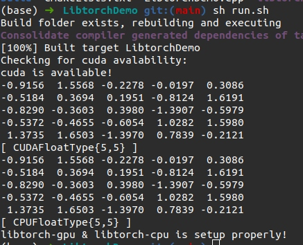

# LibtorchDemo

Trying out C++ frontend for PyTorch

## Requirements

1. C++
2. CMake

## How to use (Linux)

1. `wget https://download.pytorch.org/libtorch/cpu/libtorch-cxx11-abi-shared-with-deps-1.8.1%2Bcpu.zip`
2. `unzip libtorch-cxx11-abi-shared-with-deps-1.8.1+cpu.zip`
3. Clone this repo:

   ```
   git clone https://github.com/Abhiswain97/LibtorchDemo.git
   cd LibtorchDemo
   ```

4. Do `sh run.sh <absolute path to libtorch>`

5. If everything goes well, then below is what you should see:

<<<<<<< HEAD
```
(base) ➜  LibtorchDemo git:(main) ✗ sh run.sh ~/libtorch
Creating build folder and building the project
-- The C compiler identification is GNU 9.3.0
-- The CXX compiler identification is GNU 9.3.0
-- Detecting C compiler ABI info
-- Detecting C compiler ABI info - done
-- Check for working C compiler: /usr/bin/cc - skipped
-- Detecting C compile features
-- Detecting C compile features - done
-- Detecting CXX compiler ABI info
-- Detecting CXX compiler ABI info - done
-- Check for working CXX compiler: /usr/bin/c++ - skipped
-- Detecting CXX compile features
-- Detecting CXX compile features - done
-- Looking for pthread.h
-- Looking for pthread.h - found
-- Performing Test CMAKE_HAVE_LIBC_PTHREAD
-- Performing Test CMAKE_HAVE_LIBC_PTHREAD - Failed
-- Looking for pthread_create in pthreads
-- Looking for pthread_create in pthreads - not found
-- Looking for pthread_create in pthread
-- Looking for pthread_create in pthread - found
-- Found Threads: TRUE
-- Found CUDA: /usr/local/cuda (found version "11.2")
-- Caffe2: CUDA detected: 11.2
-- Caffe2: CUDA nvcc is: /usr/local/cuda/bin/nvcc
-- Caffe2: CUDA toolkit directory: /usr/local/cuda
-- Caffe2: Header version is: 11.2
-- Found CUDNN: /usr/lib/x86_64-linux-gnu/libcudnn.so
-- Found cuDNN: v8.1.1  (include: /usr/include, library: /usr/lib/x86_64-linux-gnu/libcudnn.so)
CMake Warning at /home/abhishek/libtorch/share/cmake/Caffe2/public/cuda.cmake:198 (message):
  Failed to compute shorthash for libnvrtc.so
Call Stack (most recent call first):
  /home/abhishek/libtorch/share/cmake/Caffe2/Caffe2Config.cmake:88 (include)
  /home/abhishek/libtorch/share/cmake/Torch/TorchConfig.cmake:68 (find_package)
  CMakeLists.txt:10 (find_package)


-- Autodetected CUDA architecture(s):  6.1
-- Added CUDA NVCC flags for: -gencode;arch=compute_61,code=sm_61
-- Found Torch: /home/abhishek/libtorch/lib/libtorch.so
-- Configuring done
-- Generating done
-- Build files have been written to: /home/abhishek/Desktop/LibtorchDemo/build
[ 50%] Building CXX object CMakeFiles/LibtorchDemo.dir/LibtorchDemo.cpp.o
[100%] Linking CXX executable LibtorchDemo
[100%] Built target LibtorchDemo
Checking for cuda avalability:
cuda is available!
 1.0837 -0.0564  0.4666  0.5129 -0.7607
-0.5698  0.1865  0.1026  1.0061  1.7183
 0.1814  1.3431 -0.3151 -0.6504  0.1164
 0.3590  0.7787 -0.3857 -2.4460  0.7244
-0.8373  0.8216 -1.3187 -1.4756 -0.1081
[ CUDAFloatType{5,5} ]
 1.0837 -0.0564  0.4666  0.5129 -0.7607
-0.5698  0.1865  0.1026  1.0061  1.7183
 0.1814  1.3431 -0.3151 -0.6504  0.1164
 0.3590  0.7787 -0.3857 -2.4460  0.7244
-0.8373  0.8216 -1.3187 -1.4756 -0.1081
[ CPUFloatType{5,5} ]
libtorch-gpu & libtorch-cpu is setup properly!
```
=======
<p align="center">
   
</p>
>>>>>>> main

<br>

> Note: In our case only the `CPUFloatType{5, 5}` tensor will print, as we have installed the cpu-olny version of libtorch. However, I have the CUDA version also that's why you see two tensors print
